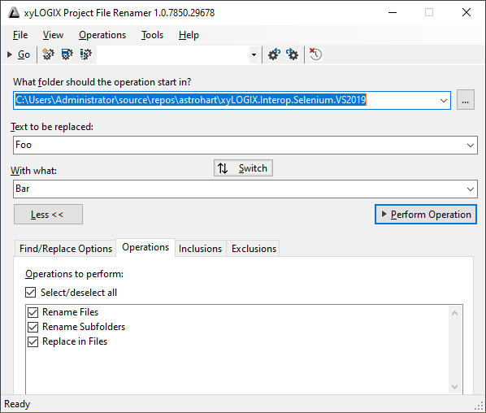
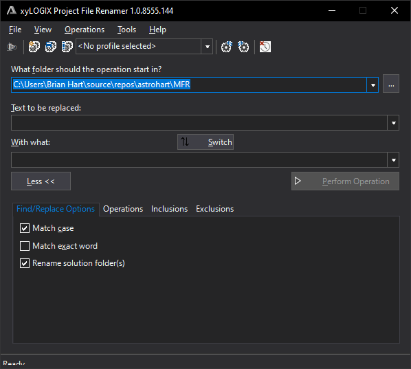
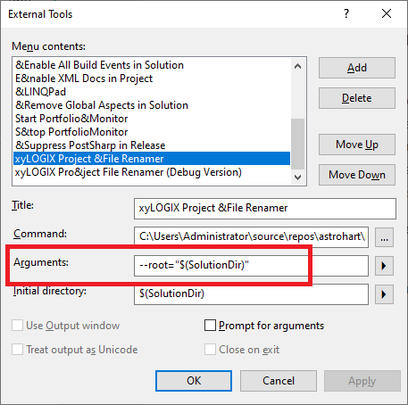
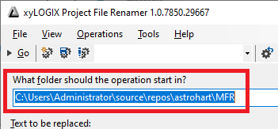
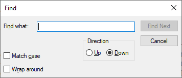
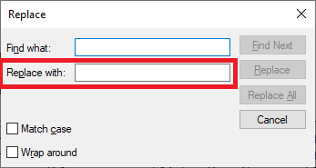
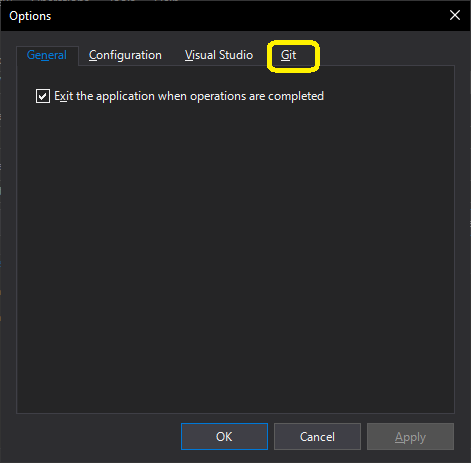
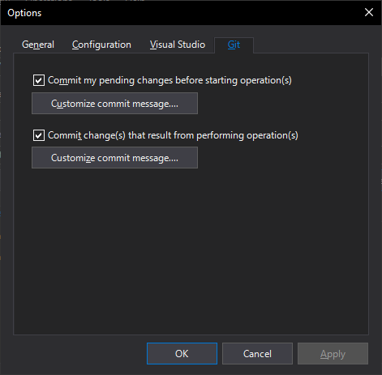
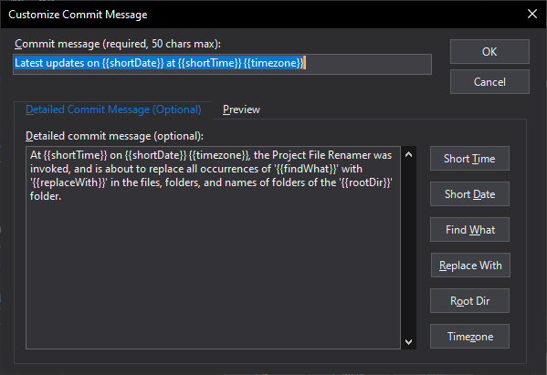
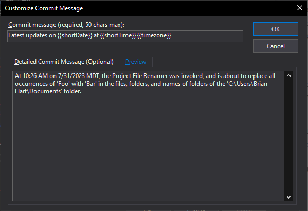

# MFR (Mass File Renamer aka xyLOGIX Project File Renamer) `Windows application`

The xyLOGIX Project File Renamer, packaged as a WinForms app, is basically like a Find/Replace and Find in Files/Replace in Files tool, but for Solution Explorer.



**Figure 1.** The main window of the xyLOGIX Project File Renamer application in Light mode.



**Figure 2.** The main window of the xyLOGIX Project File Renamer application in Dark mode.

As shown in **Figure 1** and **Figure 2**, the application is configureable to work in Light mode (**Figure 1**) or Dark mode (**Figure 2**).

## Problem solved

For large software systems, components will be named according to a common naming convention.  Such as 

```
XYZ
XYZ.Forms
XYZ.Forms.Interfaces
XYZ.Forms.Presenters.Interfaces
XYZ.GUI.Windows
```

etc.

Let's suppose the `XYZ` project is the StartUp project and is a Console Application, and all the rest of the projects are class libraries.

What if, one day, you want to rename `XYZ` to `ABC` and, to be consistent, you want every project named accordingly (because they are all associated with each other)?

Of course, don't forget that we also have to update the `.sln` file and we also have to ensure that the (by convention) the names of the folders storying the `.csproj` files match the names of the projects, and that all internal code references are preserved.

Enter **Mass File Renamer** or, as it is brand-named, the **xyLOGIX Project File Renamer**.

**NOTE:** The tool assumes you architected the solution such that the `.sln` and `.csproj` are not in the same folder; rather, the `.sln` file is at least one folder level up from all `.csproj` files.

This tool allows you to start in a given folder (which must contain one or more `.sln` files, although those files can be at any level of recursion underneath) and you want to replace text in all the names of all the projects, and, say, you want to change the names of the corresponding folders, and, oh yea -- you still need the solution to build after all is said and done.

Simply configure this app as an **External Tool** in Visual Studio, and launch it.  Then, fill in the fields and away you go. 


In the **External Tools** configuration, you will have the option of specifying

```
--root="$(SolutionDir)"
```

in the **Arguments** field of its entry in the **External Tools** dialog box, as shown:



**Figure 3.** Visual Studio's **External Tools** dialog box, with the **Arguments** box's value highligthed.

This will cause the **What Folder Should the Operation Start In** drop-down to be focused on the folder that the currently-open solution that is open in Visual Studio is located in.



**Figure 4.** The value of the **What Folder Should the Operation Start In** box being supplied by the value of the **Arguments** box in the **External Tools** window shown in **Figure 3.**

During its operation, before the app begins any of the requested operations, if it determines that one or more `.sln` files found in the folder tree beginning at the specified root are open in running instances of Visual Studio, it will:

1. Close the solution(s) in their respective instance(s) of Visual Studio;
2. Perform the requested operations; and
3. Re-open all previously closed solution(s), each in the instance of Visual Studio that it was originally open in.

**NOTE:** You can also run the tool in with the **What folder should the operation start in?** drop-down set to, in principle, _any_ folder on your hard disk, provided that that there are more than `.sln` files anywhere in the directory tree.

## Command-line execution

The xyLOGIX Project File Renamer's operations can now all be executed in a fully-automated fashion from the command line.  Currently, only the `MFR.GUI` project supports this in full; the `MFR.Console` support is still a work in progress.

We made use of the code from the [fclp](https://github.com/fclp/fluent-command-line-parser) project on GitHub -- called the `FluentCommandLineParser` and accessible using [this NuGet package](https://www.nuget.org/packages/FluentCommandLineParser/) in order to enable the command line functionality.

The following section explains the command-line arguments that are available.

### Required command-line arguments

The command-line arguments listed below in **Table 1.** are required.  Only the `--root` argument is mandatory, i.e., if it is provided, it must be given a value.

You can launch the `mfr.exe` executable with no command-line arguments; in which case, it merely reads its settings from the configuration file.

**NOTE:** By default, the application's configuration file is stored at the path:

```
%LOCALAPPDATA%\xyLOGIX, LLC\Project File Renamer\Config\config.json
```

Profiles are stored in the file

```
%LOCALAPPDATA%\xyLOGIX, LLC\Project File Renamer\Config\profiles.json
```

The mandatory/required command-line arguments are listed below.


| **Argument**     | **Meaning**                                                               |
|------------------|---------------------------------------------------------------------------|
| `--root` or `-r` | (Mandatory.) Sets the directory that this application begins in.           |
| `--findWhat`     | (Required.) Sets the string to be found in file system entries.           |
| `--replaceWith`  | (Required.) Sets the string to be substituted in file system entry names. |

**Table 1.** Mandatory and required command-line arguments.

#### Mandatory/required command-line argument detailed descriptions

##### **--root** or **-r**

**Summary**

Mandatory.  Sets the directory that this application begins processing its operations in.

**Remarks**

The `--root` argument, or its short form, `-r`, specifies a string that provides a fully-qualified pathname of a folder in which the Project File Renamer should begin its operations.

This value can be the fully-qualified pathname of any folder on the system, and even an [UNC pathname](https://en.wikipedia.org/?title=UNC_path&redirect=no) to a shared network folder. 

The only caveat to this is that the folder must contain at least one `*.sln` file, either in its root, or in any of its subfolders or their subfolders.  If this is not the case, then Project File Renamer will display an error when you attempt to process the file and folder renaming operations.

This constraint was added because this tool is expressly meant to operate on the files and folders within a Visual Studio Solution, and also on the `*.sln` file itself.

**NOTE:** A great use for this argument is from the **Tools** menu of Visual Studio, such as is discussed in the **Problem Solved** section.

**Example.**
```
--root="C:\users\MyUser\source\repos\foo\bar"
```

with the `C:\users\MyUser\source\repos\foo\bar` containing the `MyProject.sln` solution file.

##### **--findWhat**

**Summary**

Required. Sets the string to be found in file system entries.

**Remarks**



**Figure 5.** The **Find** dialog box in Windows Notepad.

Much like the **Edit**, **Find** dialog box in, say, Notepad asks you for a **Find What** value (shown in **Figure 4**), this command-line argument serves a similar function for the Project File Renamer.

The string value that is passed for this command-line argument is used as the value of the **Text to Be Replaced** box in the application window shown in **Figure 1**.

The application, when processing the requested operations, will search for this text in the names of files and folders, and inside the contents of text files.

You can also apply the `--matchCase` and `--matchWholeWord` optional command-line arguments (see below) to optionally match the `--findWhat` value on character casing and in whole word boundaries (respecting any periods (`.`) in project, project file, and folder names).

**Example.**
```
--findWhat="MFR.Engines"
```

will find the content `MFR.Engines` in:

* pathnames of folders within the root directory
* pathnames of files within the root directory
* contents of any text file within the root directory

If this command-line argument is not specified, then the **Text to Be Replaced** box will be blank when the application starts.  

You won't be able to perform any operations until a value is provided for the **Text to Be Replaced** box in **Figure 1**.  The application will still launch, however.

If the command-line argument is supplied as

```
--findWhat
```
or
```
--findWhat=""
```

then an error message will be displayed and operations can't be performed.

##### **--replaceWith**

**Summary**

Required.  Sets the string to be substituted in file system entry names.

**Remarks**

The `--replaceWith` argument, specifies the content to be substituted in file names, folder names, and file contents in place of the text that you're asking the application to search for.



**Figure 6.** The **Replace** dialog box in Windows Ntoepad, with the **Replace With** box highligthed.

Think of this command-line argument as specifying the value shown in **Figure 6**, i.e., the value to replace the found text with.

The string value that is passed to this command-line argument is entered into the **With What** box in the Project File Renamer main window, shown in **Figure 1.**

This command-line argument doesn't have to be specified on the command line unless the `--findWhat` argument is also specified.  (The two go together).

If this argument is specified on the command line, it has to have a value other than a blank string (this is what it means for the paramter to be required.).  If the argument is provided a blank string as its value, then the application won't process any requested operations.

**Example.**
```
--replaceWith="Baz"
```

Keying off the previous example, if we're searching for `MFR.Engines`, then it will be replaced with `Baz` in:

* pathnames of folders within the root directory
* pathnames of files within the root directory
* contents of any text file within the root directory

**NOTE:** One need not worry whether higher-level folders than the root have `MFR.Engines` in their names.  This is because the Project File Renamer only acts upon files and folders that are _contained within_ the root direcotry.

If this command-line argument is not specified, then the value of the **With What** box will be blank when the application starts.  

You won't be able to perform any operations until the value for the **With What** box in **Figure 1** is provided.  The application will still launch, however.

If the command-line argument is supplied as

```
--replaceWith
```
or
```
--replaceWith=""
```

then an error message will be displayed and operations can't be performed.

### Optional command-line arguments

The folllowing command-line arguments are all optional.  They are all `Boolean`, meaning, they turn various settings on or off that affect the application's behavior.

If one of the arguments below is specified on the command line, then its corresponding `Boolean` setting is turned on.  Otherwise, the setting is deactivated.

| **Flag**             | **Meaning**                                                                                                                                                  |
|----------------------|--------------------------------------------------------------------------------------------------------------------------------------------------------------|
| `--autoStart`        | (Optional.) Specify this flag to automatically start the specified operation(s) when the application starts and then quit when done.  Default is `false`.    |
| `--reOpenSolution`   | (Optional.) Indicates that any currently-open Solution in the target directory should be re-loaded when the operation(s) are completed.  Default is `false`. |
| `--matchCase`        | (Optional.) Indicates a case-sensitive search should be performed.  Default is `true`.                                                                       |
| `--matchWholeWord`   | (Optional.) Indicates that a whole-word search (respecting periods) should be performed.  Default is `false`.                                                |
| `--renameFiles`      | (Optional.) Indicates that files should be renamed.  Default is `true`.                                                                                      |
| `-?`                 | (Optional.) Displays a Help message about all the command-line arguments and flags.                                                                          |

**Table 2.** Command-line flags to turn settings on or off.

**NOTE:** The default values of `true` or `false` reflect whether the setting is on (i.e., `true`) or off (i.e., `false`) if the specified flag is not provided on the command line.

The optional command-line arguments, and the settings that they affect, are described in **Table 2** below.

To differentiate these arguments, which merely turn settings on or off, we will refer to these as _flags_ not _arguments_ per se.

## Introducing: New IntelliGit Functionality



**Figure 7.** The **Options** dialog has a new tab called **Git**.

As of the 30 July 2023 release, Project File Renamer sports a new feature, called IntelliGit�*.

As its name implies, IntelliGit gives Project File Renamer the ability to detect all the local Git repositories that are located within the directory tree of the starting folder, as well as which branch those Git repository(ies) are currently on.

Before starting the operation(s) that have been selected in the **Operations** tab of the main window, IntelliGit scans the directory tree of the staritng folder for all the local Git repository(ies) that may be present.

For each local Git repository found, IntelliGit can optionally stage the pending changes and then commit them to the current branch.  If a remote is configured for that repository, and if the local machine is connected to the Internet, IntelliGit will then push the committed and pending changes to the remote branch.   All this is done automatically, before files and folders are renamed or the contents of files are altered by this application.

Likewise, after the selected Project File Renamer operation(s) are performed, IntelliGit can optionally stage, commit, and push the changes made by Project File Renamer to all the local Git repository(ies), and their configured remote(s), automatically.



**Figure 8.** The options available on the **Git** tab of the **Options** dialog box.

Let's do a deep dive into the controls and settings exposed by the **Git** tab of the **Options** dialog box.

### Git settings

On the **Git** tab of the **Options** dialog box, which is shown in **Figure 8**, there are a number of settings.

The **Commit My Pending Changes Before Starting Operation(s)** check box enables or disables the functionality of committing existing changed files and pushing those changes to the `origin` remote, if configured, IntelliGit operation.  If this check box is cleared (as in, unchecked), then the corresponding IntelliGit operation won't be performed.

Click the **Customize Commit Message** button under this check box to customize what is used as the commit message, as well as the optional, more detailed commit message, for pending changes committed before the selected operation(s) are started.

The **Commit Change(s) That Result from Performing Operation(s)** check box enables or disables the functionality of committing the results of running the Project File Renamer operation(s) to all the local Git repository(ies) in the directory tree, along with pushing the changes to the remote, after the requested Project File Renamer operation(s) have been successfully performed, automatically.

Click the **Customize Commit Message** button under this check bx to customize what is use as the commit message, as well as the optional, more detailed commit message, for pushing the results of running the selected Project File Renamer operation(s) on all the local Git repository(ies) under the directory tree of the starting directory.

**BONUS FEATURE:** IntelliGit is called that because it's intelligent enough to alter its behavior depending on what branch is currently checked out for each local Git repositor, and to perform the `push`, `pull`, `stage`, and `commit` Git operations to the corresponding checked-out branch.  Likewise, it's also smart enough to detect whether more than zero remote(s) are configured, select the one named `origin` by default, and use that remote for `pull` and `push` -- or do not `pull` or `push` if there are no remotes configured.

### Customizing commit messages

Now that we've discussed the options on the **Git** tab of the **Options** dialog box in Project File Renamer, let's dive a little deeper into the options that are displayed when you click either of the **Customize Commit Message** buttons on this tab.  

The **Customize Commit Message** buttons both bring up the **Customize Commit Message** dialog box, shown in **Figure 9** and **Figure 10**.  This dialog box allows you to configure what is used as the commit and, optionally, the detailed commit messages when IntelliGit performs its operations.

The **Customize Commit Message** dialog box also comes complete with optional replacement parameters for the optional, detailed commit message.  



**Figure 9.** The **Customize Commit Message** dialog box.

The **Commit Message** text box is pretty self-explanatory, so we will not discuss it here.

On the dialog box, underneath the **Commit Message** text box, you'll notice two tabs: **Detailed Commit Message (Optional)** and **Preview**.

The **Detailed Commit Message (Optional)** tab provides a space for you to type a detailed message to be added to the commit.  Next to the text area, to the right, are six buttons.  These insert replacement parameters, such as `{{shortTime}}`, into the text area at the insertion point.

For example, you can click the **Root Dir** button to insert a `{{rootDir}}` replacement parameter at the position of the cursor.  This replacement parameter is replaced with the pathname of the value in the **Starting Folder** text box at runtime.

There is also a way to preview what the detailed commit message will look like at runtime.  This is displayed by clicking on the **Preview** tab.

**NOTE:** The placeholder buttons only insert values into the text box in the **Detailed Commit Message** tab.  You can copy and paste the replacement parameters to the **Commit Message** text box, but that text box will only allow 50 characters to be entered into it.  Replacement parameters do work in the **Commit Message** box as well.  There is no preview for the **Commit Message** box.

### Previewing your detailed commit message



**Figure 10.** Previewing a detailed commit message in the **Preview** tab of the **Customize Commit Message** dialog box.

As stated previously, you can preview what your detailed commit message will actually look like when fed to Git.  You do this by clicking on the **Preview** tab in the **Customize Commit Message** dialog box, as shown in **Figure 10**.

The **Preview** tab contains a text area that displays your detailed commit message (if any) with dummy values inserted for the replacement parameters.

If you see things such as `{0}` or `{4}` in the **Preview** tab, this probably means that there is an extra `{` or `}` around yuor replacement parameters.

### Replacement parameter reference

The following table explains the replacement parameters and what they mean:

| **Parameter**     | **Replaced With**                                                                                                                                                                                                                                            |
|-------------------|--------------------------------------------------------------------------------------------------------------------------------------------------------------------------------------------------------------------------------------------------------------|
| `{{shortTime}}`   | The time of day of the commit, in `HH:MM TT` format, where `HH` is the current hour in 12-hour time, and `MM` are the minutes.  `TT` is `AM` for the morning, and `PM` if it's afternoon.  For example: `6:49 AM` might be a replacement for this parameter. |
| `{{shortDate}}`   | The date on which the commit is made, in `MM/DD/YYYY` format, such as `04/23/1980`.                                                                                                                                                                          |
| `{{findWhat}}`    | The text that you are searching for in the operation(s) and which is to be replaced/renamed.                                                                                                                                                                 |
| `{{replaceWith}}` | The text that the user is replacing the search text with.                                                                                                                                                                                                    |
| `{{rootDir}}`     | The fully-qualified pathname of the folder on the local machine that the application has been instructed to begin processing the operations in.                                                                                                              |
| `{{timezone}}`    | The standardized, 3-letter abbreviation for the time zone that the local machine's clock is in.  Daylight Saving Time is accounted for.                                                                                                                      |


*IntelliGit is a trademark of xyLOGIX, LLC.  All rights reserved.